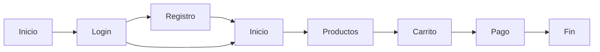
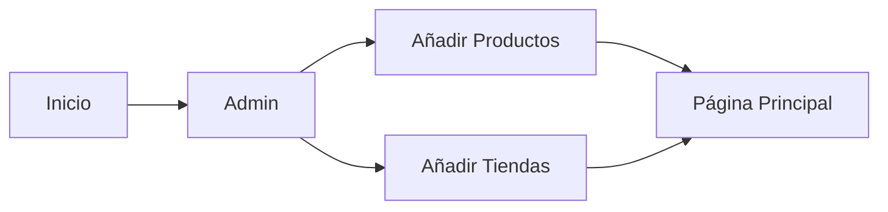

# SIU_final

## 1. Introduction

Este es la última práctica de la asignatura de Sistemas Interactivos y Ubicuos. Esta aplicación web ha sido desarrollada por los siguientes miembros del grupo 11:

- Sergio Barragán Blanco
- Javier Campos
- Enrique
- Eduardo Alarcón

## 2. Descripción de la aplicación

Es una aplicación que simula la interfaz de compra de objetos, pudiendo seleccionar el producto mediante la voz. La aplicación cuenta con un sistema de reconocimiento de voz que permite al usuario seleccionar el producto que desea comprar. Además, la aplicación es multiusuario, y cuenta con un panel de administrador para crear productos.

## 3. Tecnologías utilizadas

- HTML
- CSS
- JavaScript
- Node.js
- Express
- Socket.io
- Web Speech API

## 4. Instrucciones de uso

Para poder utilizar la aplicación, es necesario seguir los siguientes pasos:

1. Clonar el repositorio
2. Instalar las dependencias con `npm install`
3. Iniciar el servidor con `node server.js`
4. Acceder a la aplicación en `localhost:3000`

## 5. Features / Funcionalidades

Existe un micrófono en la parte superior de la página que permite al usuario seleccionar el producto que desea comprar mediante la voz así como navegar por ella. Además, la aplicación cuenta con un panel de administrador que permite añadir productos a la tienda y tiendas.
Para usar la aplicación hay que iniciar sesión en el menu de la parte superior izquierda. Se puede crear un usuario nuevo en la parte de registro, y si no, se puede usar uno ya creado, por ejemplo el usuario `1` con contraseña `1`.

Con respecto a la entrega de la parte 1, creemos que hemos realizado todas las tareas que nos propusimos, añadiendo alguna, o dándole una interpretación diferente. En concreto, esto ocurre con el reconocimiento de voz, que no se limita a la búsqueda de productos, sino que también se puede usar para navegar por la página. Además, hemos añadido un panel de administrador que permite añadir productos a la tienda y tiendas que no estaba en la propuesta inicial.

Lo que no utilizamos fueron los prototipos de baja funcionalidad.

Para usar la función de pago, es necesario enfocar con la cámara al método de pago, ya sean billetes o tarjeta, para que la aplicación lo detecte y realice el pago.

## 6. Diagrama de navegación

## 7. Extras

Hemos desplegado al aplicación en un servidor para que sea más fácil acceder a ella. Se puede acceder a la aplicación en la siguiente dirección: [WEB](https://siu.astrak.es/)
